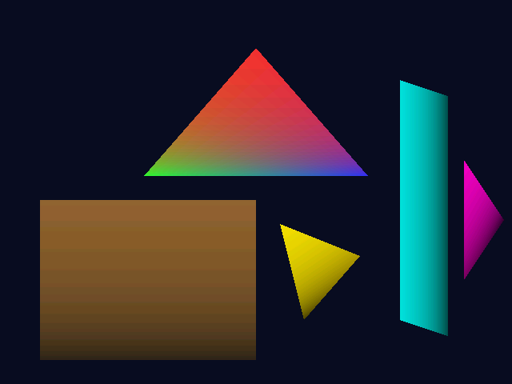

# Celery3D

A custom 3D graphics card inspired by the 3dfx Voodoo 1, implemented on an FPGA with PCIe interface and a Glide-style graphics API. Made by me and my good friend Claude.

## Project Goals

Build a functional retro-style GPU that can render textured, Gouraud-shaded 3D graphics at 640x480 resolution. The design philosophy follows the original Voodoo 1: CPU handles vertex transformation (T&L), GPU handles rasterization and texturing.

## Target Specifications

| Specification | Target | Notes |
|---------------|--------|-------|
| Resolution | 640x480 @ 60Hz | 800x600 stretch goal |
| Color Depth | 16-bit (RGB565) | Authentic to era |
| Texture Format | RGB565, up to 256x256 | Single TMU |
| Features | Gouraud shading, depth buffer, bilinear filtering, alpha blending | Fixed-function pipeline |
| Interface | PCIe x4 Gen2 | ~2 GB/s bandwidth |
| Fill Rate | ~50 MPixels/sec | Voodoo 1 equivalent |

## Hardware Platform

**Target Board:** [Open Source SDR Lab Kintex-7 XC7K325T](https://opensourcesdrlab.com/products/fpga-xilinx-kintex-7-xc7k325t-pcie-development-board-with-dual-gigabit-ethernet-ports-dual-10-gigabit-sfp-optical-communication)

| Feature | Specification |
|---------|---------------|
| FPGA | Xilinx Kintex-7 XC7K325T-2FFG676I |
| Logic | 326K cells, 840 DSPs, 16Mb BRAM |
| Memory | 1GB DDR3, 32MB Flash |
| PCIe | x4 Gen2 (x8 physical slot) |
| Video Output | 2x HDMI out (1080p@60Hz), 1x HDMI in |
| Network | 2x 10G SFP+, 2x Gigabit Ethernet |
| Price | ~$341 USD |

This board plugs directly into a PC's PCIe slot, enabling the GPU to communicate with the host via DMA while outputting video over HDMI. Just like a real graphics card!

## Architecture

```
┌─────────────────────────────────────────────────────────────────┐
│                         HOST PC (CPU)                           │
│   - Vertex transformation (model/view/projection)               │
│   - Sends screen-space triangles to GPU via PCIe                │
└─────────────────────────────────────────────────────────────────┘
                              │ PCIe
                              ▼
┌─────────────────────────────────────────────────────────────────┐
│                      CELERY3D GPU (FPGA)                        │
│                                                                 │
│  ┌──────────────┐    ┌──────────────┐    ┌──────────────┐       │
│  │   Command    │───▶│   Triangle   │───▶│  Rasterizer  │       │
│  │   Processor  │    │    Setup     │    │              │       │
│  └──────────────┘    └──────────────┘    └──────────────┘       │
│         ▲                                       │               │
│         │                                       ▼               │
│  ┌──────────────┐    ┌──────────────┐    ┌──────────────┐       │
│  │    Video     │◀───│  Framebuffer │◀───│   Texture    │       │
│  │   Output     │    │  Controller  │    │  Mapping Unit│       │
│  └──────────────┘    └──────────────┘    └──────────────┘       │
│         │                   │                                   │
│         ▼                   ▼                                   │
│      [HDMI]            [DDR3 VRAM]                              │
└─────────────────────────────────────────────────────────────────┘
```

### GPU Pipeline Stages

1. **Command Processor** - Reads commands from PCIe ring buffer, decodes draw calls
2. **Triangle Setup** - Computes edge equations and attribute gradients
3. **Rasterizer** - Scan converts triangles to fragments using edge equations
4. **Texture Mapping Unit** - Fetches texels, performs bilinear filtering
5. **Pixel Operations** - Depth test, alpha blend, fog, write to framebuffer
6. **Framebuffer Controller** - Arbitrates DDR3 access between rasterizer and video output
7. **Video Output** - Generates HDMI timing, streams framebuffer to display

## Software Stack

```
┌─────────────────────────────┐
│     Application (Game)      │
├─────────────────────────────┤
│   libcelery (Glide-style)   │  ← User-space graphics API
├─────────────────────────────┤
│   celery.ko (Linux driver)  │  ← PCIe driver, memory management
├─────────────────────────────┤
│         Linux Kernel        │
└─────────────────────────────┘
```

### API Style (Glide-inspired)

```c
// Initialize
CeleryContext* ctx = celeryInit();

// Load texture
CeleryTexture* tex = celeryTextureCreate(ctx, 256, 256, CELERY_FORMAT_RGB565);
celeryTextureUpload(tex, pixels);

// Render
celeryBufferClear(ctx, CELERY_CLEAR_COLOR | CELERY_CLEAR_DEPTH);
celeryTextureBind(ctx, tex);

CeleryVertex tri[3] = {
    { .x = 320, .y = 100, .z = 0.5f, .u = 0.5f, .v = 0.0f, .color = 0xFFFFFF },
    { .x = 200, .y = 380, .z = 0.5f, .u = 0.0f, .v = 1.0f, .color = 0xFFFFFF },
    { .x = 440, .y = 380, .z = 0.5f, .u = 1.0f, .v = 1.0f, .color = 0xFFFFFF },
};
celeryDrawTriangle(ctx, tri);

celeryBufferSwap(ctx);
```

## Project Structure

```
celery3d/
├── rtl/                    # Verilog/SystemVerilog source
│   ├── core/              # GPU core modules
│   ├── memory/            # DDR3 and framebuffer controllers
│   ├── video/             # HDMI output
│   ├── pcie/              # PCIe interface
│   └── tb/                # Testbenches
├── sim/
│   └── reference/         # Software reference renderer (C + SDL2)
├── driver/                # Linux kernel driver
├── libcelery/             # User-space API library
├── demos/                 # Demo applications
└── docs/                  # Documentation
```

## Design Decisions

### Why Fixed-Function Pipeline?
The Voodoo 1 had no programmable shaders, just configurable texture and blend modes. This dramatically simplifies the hardware while still enabling impressive 3D graphics. Shaders can be a future enhancement.

### Why RGB565?
- Authentic to the Voodoo era
- Half the bandwidth of RGB888
- 64K colors is plenty for retro aesthetics
- Simplifies DDR3 burst alignment

### Why CPU-side T&L?
- Matches original Voodoo architecture
- Reduces GPU complexity significantly
- CPU is fast enough for vertex math
- GPU focuses on what it does best: pixel pushing

### Why Fixed-Point Arithmetic?
- Deterministic timing (important for FPGA)
- No floating-point IP cores needed
- Sufficient precision for 640x480
- Authentic to original hardware

### Why PCIe over USB/Ethernet?
- Direct memory-mapped I/O
- Low latency command submission
- DMA for efficient texture uploads
- Real graphics card experience

## Building

### Software Reference Renderer

```bash
cd sim/reference
mkdir build && cd build
cmake ..
make
./celery_ref
```

**Dependencies:** SDL2, CMake, C compiler

**Controls:**
- `ESC` - Quit
- `T` - Toggle texturing
- `G` - Toggle Gouraud shading

### RTL Simulation & Synthesis

**Dependencies:** Verilator, Vivado ML Edition (2024.1+ recommended)

```bash
cd rtl

# Run Verilator simulation (outputs rasterizer_output.ppm)
make sim

# View the rendered output
eog rasterizer_output.ppm  # or any image viewer

# Run Verilator linting only
make lint

# Open waveform viewer (after simulation)
make wave
```

**Vivado Synthesis (requires Kintex-7 license or 30-day eval):**

```bash
# Source Vivado environment first
source /opt/Xilinx/Vivado/2024.1/settings64.sh

# Run synthesis + timing analysis (target: 50 MHz)
make synth

# View timing summary
make timing

# Clean Vivado build artifacts
make clean-vivado
```

**Target Device:** Xilinx Kintex-7 XC7K325T-2FFG676 (Open Source SDR Lab board)

## Implementation Phases

- [x] **Phase 1:** Software reference renderer
- [ ] **Phase 2:** Video output (HDMI test pattern)
- [ ] **Phase 3:** DDR3 framebuffer controller
- [x] **Phase 4:** Rasterization pipeline (in progress - basic Gouraud shading working!)
- [ ] **Phase 5:** PCIe integration
- [ ] **Phase 6:** Linux driver
- [ ] **Phase 7:** Graphics API library
- [ ] **Phase 8:** Demos and polish

### Rasterizer Output

The RTL rasterizer with Gouraud shading, rendering a test triangle with per-vertex colors (red, green, blue):



## Resources

- [3dfx Glide SDK Documentation](https://3dfx.retropc.se/reference.html)
- [A Trip Through the Graphics Pipeline](https://fgiesen.wordpress.com/2011/07/09/a-trip-through-the-graphics-pipeline-2011-index/)
- [Project F FPGA Graphics Tutorials](https://projectf.io/)
- [Scratchapixel Rasterization](https://www.scratchapixel.com/lessons/3d-basic-rendering/rasterization-practical-implementation/overview-rasterization-algorithm.html)

## License

MIT License - See LICENSE file for details.

## Acknowledgments

- 3dfx Interactive for the Voodoo 1 inspiration
- The FuryGPU project for proving hobbyist GPUs are possible
- Project F for excellent FPGA graphics tutorials